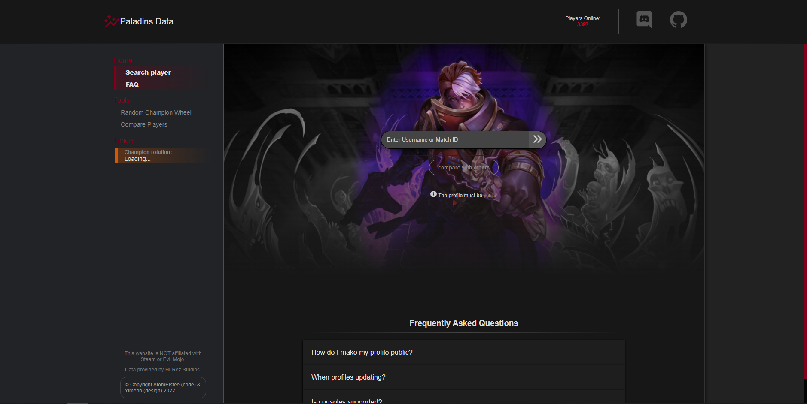

# Paladins Data
> This site is made to look at player statistics and compare players. Also, there is a random champion wheel, just to make games funnier.

Should be available at [Heroku](https://paladinsdata.herokuapp.com/players#playersearch) (You can have long loading first time because of free hosting)

This project was made in 1 month to learn and train React, but accidentally, for this project I was forced to get knowledge about Express, MongoDB, GraphQL, and Apollo client/server. I was not expecting that creating a full-stack project would be so hard for me. Also, I got experience with working API thanks for that to Hirez studio and their API.

## Meta

Dmitry Kulakov – [@AtomEistee](https://twitter.com/AtomEistee) – atomeistee@gmail.com

